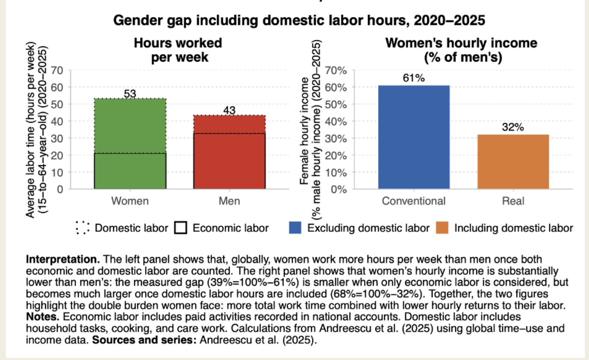

# Gender & Sexuality — Rights, Violence & Systemic Exclusion

## LGBTQ+ Rights in India

- **Section 377** of the Indian Penal Code criminalized consensual same-sex relations for 158 years. It was struck down in *Navtej Singh Johar v. Union of India* in **September 2018**.
- In **2023**, the Supreme Court declined to legalise same-sex marriage (*Supriya Chakraborty v. Union of India*), leaving LGBTQ+ couples with no legal recognition of their relationships or families.
- The **Transgender Persons (Protection of Rights) Act 2019** was widely criticised by trans communities and rights groups for requiring intrusive state certification of gender identity — effectively making the state the arbiter of a person's gender.
- **Conversion therapy** is banned in India as a punishable offence.
- Hijra and other gender-diverse communities face systematic exclusion from employment, healthcare, and housing — despite the *NALSA v. Union of India* (2014) judgment recognising the legal right to self-identify gender.
- **LGBTQ+ Dalits and Adivasis** face compounded discrimination — caste, class, and sexuality intersect violently. Discrimination does not operate along a single axis.

### Sources
- [Navtej Singh Johar v. Union of India (2018) — Supreme Court judgment](https://main.sci.gov.in/supremecourt/2016/7929/7929_2016_Judgement_06-Sep-2018.pdf)
- [Same-Sex Marriage Ruling (2023) — The Hindu](https://www.thehindu.com/news/national/supreme-court-same-sex-marriage-verdict/article67461150.ece)
- [NALSA v. Union of India (2014) — Transgender Rights Judgment](https://main.sci.gov.in/jonew/judis/41411.pdf)
- [Transgender Persons Act 2019 — Human Rights Watch](https://www.hrw.org/news/2019/12/02/india-transgender-bill-flawed)
- [ILGA World — State-Sponsored Homophobia Report](https://ilga.org/state-sponsored-homophobia-report)
- [LGBTQ+ Rights in India — Wikipedia](https://en.wikipedia.org/wiki/LGBT_rights_in_India)

---

## Gender Gap

India consistently ranks among the lowest in global gender gap indices. The gap is not uniform — it is compounded by caste and class:

- Dalit women face violence at higher rates than upper-caste women.
- Adivasi women are disproportionately displaced by mining and infrastructure projects.
- The informal economy, where most women work, offers no protection, no minimum wage enforcement, and no maternity provision.

---

## Intersectionality

Inequality is not additive — it is multiplicative. A Dalit, trans woman living in a rural area faces:

- Caste discrimination (access to resources, housing, occupation)
- Transphobia (employment, healthcare, family rejection)
- Gendered violence (disproportionate targeting)
- Class exclusion (informal economy, no safety net)

Policy that addresses one axis without the others reproduces harm along the others.

---

*To add a fact, see [recommendations/TEMPLATE.md](../../recommendations/TEMPLATE.md)*
